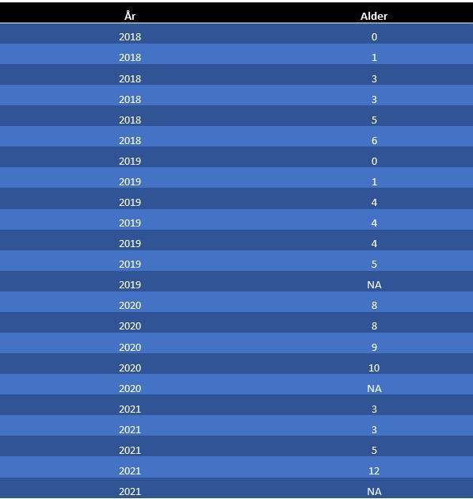

Snabbinstruktion
================

Döda björnar
------------

Formatet för att lägga in döda björnar är en semikolonseparerad textfil
(.csv) med två kolumner. En kolumn för årtal och en för ålder på björnen
(0-19). För honor med okänd ålder sätter man värdet till NA. Björnar får
då istället ett slumpmässigt tilldelat värde baserat på tidigare
avskjutningsdata i Sverige. Det är bara data från de två kolumnerna som
tas med i beräkningen och det är därför viktigt att de är korrekta.
Varje rad motsvarar en björn så om flera björnar har samma ålder så blir
varje individ en ny rad.

### Modellen och demografiska data

Vi använder oss av en existerande publicerad modell (Støen m.fl. 2021)
som vi anpassat för förvaltningen i Sverige. Den är baserad på svenska
data (skjutna och radiomärkta björnar) från en artikel om
populationsdynamik hos björn kopplat till jakt (se Bischof m.fl. 2018).
Med denna modell kan man göra prognoser på upp till 5 år framåt i tiden.

Vi använder en åldersstrukturerad populationsmodell (rekonstruerad
populationsmodell) för honbjörnar med hjälp av matrisalgebra (Caswell
2001), som är en standard för att modellera arter med långsam
livshistoria. Modellen förutsätter en sluten population dvs vi kan inte
ta hänsyn till att individer flyttar in- eller ut ur populationen
(immigration och emigration). Hanar kan röra sig över stora områden och
flytta långa sträckor från där de är födda, vilket innebär att de kan
hamna i andra län (eller länder) än födselområde eller där hittats vid
en inventering. Honor däremot flyttar betydligt kortare sträckor och
merparten av dessa förväntas hamna relativt nära sitt födselområde.
Detta är en av orsakerna till att modellen enbart är baseras på honor.
Modellen är en “post-breeding census” modell vilket innebär perioden
motsvarar tiden efter att de har kommit ut av idet men före jaktstarten
på hösten. Transitions matriser används för att skatta sannolikheten att
överleva och reproducera sig ett givet år t^+1. En hona i reproduktiv
ålder (minst 4 år) måste först överleva fram till år t för att komma ut
med årsungar (“cub-of-the-year”, COY) år t^+1. Rekryteringen R är därför
given enligt följande:

*R**i*, *t* = *S**i*, *t* \* *P*(*C**O**Y*)*i*, *t* \* *L**S**i*, *t*
,

där S naturlig överlevnad, P (COY) sannolikheten att komma ut ur idet
med årsungar och LS kullstorlek. De nedsänkta tecknen i är åldersklass
och t är år. Både P (COY) och LS kommer från radiomärkta honor i det
Skandinaviska björnprojektet (Bischof m.fl. 2018). Baserat på dessa
ärden beräknas en åldersstruktur och sannolikheten att reproduceras sig
vid olika åldrar. Modellen inkluderar stokastiska (slumpmässiga)
förhållanden och osäkerhet i demografiska parametrar. Dödligheten från
jakt subtraheras från den simulerade populationen i slutet på varje
tidssteg (år). Data på känd ålder vid jakt från tidigare år används för
att slumpmässigt tilldela risken att bli skjuten vid olika åldrar i den
simulerade populationen. Genom att ladda upp en fil med känd dödlighet
på honor och deras ålder mellan inventeringsåret och fram till nuvarande
år minskar vi osäkerheten i modellen.

Basdata för olika populationsparametrar illustreras i figuren nedan. Den
delen av modellen är fast men kan uppdateras med nya data i framtiden.

